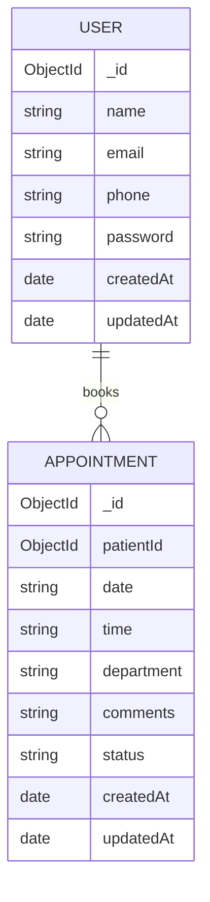

# Database Design for Doctor Appointment App

## Overview
This project uses MongoDB with Mongoose. The database is designed around a simple patient-booking workflow with two main collections:
- Users
- Appointments

## ER Diagram


## 1. Users Collection
Stores patient account information.

### Fields
- _id: ObjectId
- name: String (required)
- email: String (required, unique)
- phone: String (required)
- password: String (required, hashed)
- createdAt: Date
- updatedAt: Date

### Purpose
Represents a registered patient who can sign up, log in, and book appointments.

## 2. Appointments Collection
Stores appointment bookings made by users.

### Fields
- _id: ObjectId
- patientId: ObjectId (references Users._id)
- date: String (required)
- time: String (required)
- department: String (required)
- comments: String (optional)
- status: String (default: pending)
- createdAt: Date
- updatedAt: Date

### Purpose
Represents a booking request made by a patient for a specific date, time, and department.

## Relationships
- One User can have many Appointments.
- Each Appointment belongs to one User through patientId.

## Recommended Schema Design
### User
```json
{
  "_id": "64b1f6d152ec8c0f9eb0f2b1",
  "name": "John Doe",
  "email": "john@example.com",
  "phone": "+1234567890",
  "password": "$2b$10$abc123...",
  "createdAt": "2026-07-05T10:00:00.000Z",
  "updatedAt": "2026-07-05T10:00:00.000Z"
}
```

### Appointment
```json
{
  "_id": "64b1f6d152ec8c0f9eb0f2b2",
  "patientId": "64b1f6d152ec8c0f9eb0f2b1",
  "date": "2026-07-10",
  "time": "10:30",
  "department": "Cardiology",
  "comments": "Need follow-up consultation",
  "status": "pending",
  "createdAt": "2026-07-05T10:05:00.000Z",
  "updatedAt": "2026-07-05T10:05:00.000Z"
}
```

## SQL Equivalent Conceptual Model
If this project were moved to a relational database, the design could be expressed as:

```sql
CREATE TABLE users (
  id INT PRIMARY KEY AUTO_INCREMENT,
  name VARCHAR(100) NOT NULL,
  email VARCHAR(100) UNIQUE NOT NULL,
  phone VARCHAR(20) NOT NULL,
  password VARCHAR(255) NOT NULL,
  created_at TIMESTAMP DEFAULT CURRENT_TIMESTAMP,
  updated_at TIMESTAMP DEFAULT CURRENT_TIMESTAMP
);

CREATE TABLE appointments (
  id INT PRIMARY KEY AUTO_INCREMENT,
  patient_id INT NOT NULL,
  appointment_date DATE NOT NULL,
  appointment_time TIME NOT NULL,
  department VARCHAR(100) NOT NULL,
  comments TEXT,
  status VARCHAR(20) DEFAULT 'pending',
  created_at TIMESTAMP DEFAULT CURRENT_TIMESTAMP,
  updated_at TIMESTAMP DEFAULT CURRENT_TIMESTAMP,
  FOREIGN KEY (patient_id) REFERENCES users(id)
);
```

## Future Enhancements
Possible future collections or fields:
- Doctors collection
- Doctor availability and time slots
- Appointment status values: pending, confirmed, cancelled, completed
- Payment or billing information
- Admin users
- Notifications and reminders
